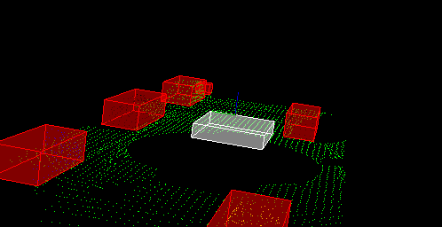

# Project 1 - Lidar Object Detection



## Software User
1. [Point Cloud Library](https://pointclouds.org/)

## Building the project
### On Ubuntu 16.04
```bash
$ sudo apt install libpcl-dev
$ cd ~
$ git clone https://github.com/rtkartista/sfe_projects.git
$ cd p1
$ mkdir build && cd build
$ cmake ..
$ make
$ ./environment
```
## Project Description
The project includes four important sections to demonstrate object detection pipleline
1. Fliteration, here, the scaned data from the lidars which is read from the .pcd file is first resized to create a region of interest. Then, voxel filteration is done to decrease the resolution on the loaded data.

2. Segmentation, here, the data is seperated into two region, the ground plane cloud and next the obstacle point cloud using RANSAC algorithm.

3. Clustering, here, the obstacle cloud data obtained from the previous step is stored in a # dimensional KD-Tree. Then by setting distance tolerance parameter, clusters of obstacles are detected using Eucledian clustering algorithm.

4. Finally, rendering the project and drawing rectangular boxes around the clusters. Additionally, PCA analysis is done on the data and th boxes are rotated in the yaw direction using quaternion rotaions. It is observed that boxes after rotations do not fit the clusters. It is due to the limited field of view of the LIDAR sensors. It is also a reason of adding additional sensors to the vehicle to achieve autonomy.

## Additional Notes
1. This project uses abstact C++ data types like templates
2. For the project submission, we had to write the functions from stratch without the help of PCL. And additionally, an empty project was provided by Udacity for classroom assignments
```
git clone https://github.com/udacity/SFND_Lidar_Obstacle_Detection.git
```
# LIDAR-data-processing-p1-udacity-sensorfusion
